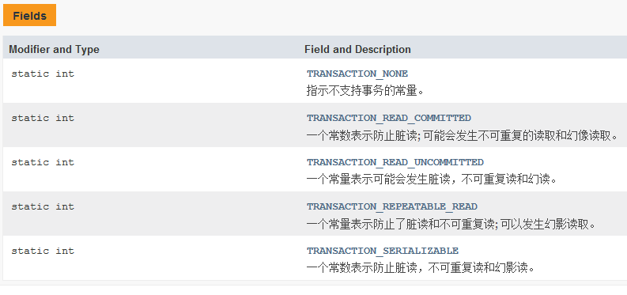

[TOC]

# 事务

## 概念
#### 特性
* 原子性：整体
* 一致性：完成
* 隔离性：并发
* 持久性：结果
#### 隔离问题
* 脏读：一个事务读取到另一个事务没有提交的数据
* 不可重复读：一个事务读取到另一个事务已经提交的数据（update）
* 虚读（幻读）：一个事务读取到另一个事务已经提交的数据（insert）
#### 隔离级别
解决方案：
* read uncommitted：读未提交，存在 3 个问题
* read committed：读已提交，解决脏读，存在 2 个问题
* repeatable read：可重复读，解决脏读、不可重复读，存在 1 个问题
* serializable：串行化，都解决，但存在堵塞
#### 有关常量
在 Connection 类中



## 事务简单操作
#### 整体事务
假设 A B C D 是一个事务
```java
    try(
            Connection conn = ...;
    ){
        //开启事务
        conn.setAutoCommit(false);
        A;
        B;
        C;
        D;
        //提交事务
        conn.commit();
    }catch(){
        conn.rollBack();
    }
```
#### 可选事务
A B 必选，C D 可选
```java
    try(
            Connection conn = ...;
    ){
        Savepoint savepoint = null;
        //开启事务
        conn.setAutoCommit(false);
        A;
        B;
        //设置保存点
        savepoint = conn.setSavepoint();
        C;
        D;
        //提交事务
        conn.commit();
    }catch(){
        //C D 异常
        if(savepoint != null){
            //回滚到 C D 之前
            conn.rollBack(savepoint);
            //提交 A B 
            conn.commit();
        }
    }
```


## 事务管理
导入 jar：
* transaction ---> tx

#### 顶级接口
###### PlatformTransactionManager
平台事务管理器，Spring 管理事务必须使用事务管理器
* 作用：进行事务管理时，必须配置事务管理器
###### TransactionDefinition
事务详情（事务定义/属性），用于 Spring 确定事务详情（隔离级别、是否只读、超时时间）等，传参到事务管理器
* 作用：配置详情，然后 Spring 将配置封装到该对象
###### TransactionStatus
事务状态，用于 Spring 记录当前事务的运行状态（是否有保存点、事务是否完成）等，通过事务管理器得到
*作用：Spring 底层根据状态进行操作

### PlatformTransactionManager 事务管理器
#### 源码
```java
    public interface PlatformTransactionManager {
        //通过事务详情，获得事务状态，从而管理事务
        TransactionStatus getTransaction(TransactionDefinition var1) throws TransactionException;
        //根据状态提交
        void commit(TransactionStatus var1) throws TransactionException;
        //根据状态回滚
        void rollback(TransactionStatus var1) throws TransactionException;
    }
```
导入 jar（平台事务管理器的实现类）：
* orm
#### 常见事务管理器
* DataSourceTransactionManager：JDBC 事务管理器（JdbcTemplate）
* HibernateTransactionManager：Hebernate 事务管理器

### TransactionDefinition 事务详情
#### 源码
```java
    public interface TransactionDefinition {
    
        //传播行为
        int PROPAGATION_REQUIRED = 0;
        int PROPAGATION_SUPPORTS = 1;
        int PROPAGATION_MANDATORY = 2;
        int PROPAGATION_REQUIRES_NEW = 3;
        int PROPAGATION_NOT_SUPPORTED = 4;
        int PROPAGATION_NEVER = 5;
        int PROPAGATION_NESTED = 6;
        
        //隔离级别 0,1,2,4,8（二进制表示）
        int ISOLATION_DEFAULT = -1;
        int ISOLATION_READ_UNCOMMITTED = 1;
        int ISOLATION_READ_COMMITTED = 2;
        int ISOLATION_REPEATABLE_READ = 4;
        int ISOLATION_SERIALIZABLE = 8;
        
        int TIMEOUT_DEFAULT = -1; //默认超时时间，即数据库底层超时时间
        //获取传播行为
        int getPropagationBehavior();
        //获取隔离级别
        int getIsolationLevel();
        //获取超时时间
        int getTimeout();
        //是否只读（查询：只读）
        boolean isReadOnly();
        //配置事务详情名称，例如 save，add* 等
        String getName();
    }
```
#### 传播行为
如何在两个业务之间共享事务，一共有 7 中行为，对应源码中 7 个常量
* PROPAGATION_REQUIRED（必须）：支持当前事务，如果 A 有事务，则 B 将使用该事务，如果 A 没有，则 B 新建一个事务
* PROPAGATION_SUPPORTS（支持）：支持……，如果 A 没有，则 B 以非事务执行
* PROPAGATION_MANDATORY（强制）：支持……，如果 A 没有，则 B 抛出异常
* PROPAGATION_REQUIRES_NEW（必须新）：如果 A 有事务，挂起（进程被暂时调离出内存，当条件允许的时候，会被操作系
    统再次调回内存，重新进入等待被执行的状态即就绪态） A 的事务，则 B 创建一个新事务，如果 A 没有事务，则 B 
    创建一个新事务
* PROPAGATION_NOT_SUPPORTED（不支持）：如果 A 有事务，A 的事务挂起，B 以非事务执行，如果 A 没有事务，B 以非事
    务执行
* PROPAGATION_NEVER（不）：不支持当前事务，如果 A 有事务，B 抛出异常，如果 A 没有事务，B 以非事务执行
* PROPAGETION_NESTED（嵌套）：A B 底层采用保存点机制，形成嵌套事务

### TransactionStatus 事务状态
#### 源码
```java
    public interface TransactionStatus extends SavepointManager, Flushable {
        //是否是新事务
        boolean isNewTransaction();
        //是否有保存点
        boolean hasSavepoint();
        //设置回滚
        void setRollbackOnly();
        //是否回滚过
        boolean isRollbackOnly();
        //刷新（同步状态）
        void flush();
        //是否完成
        boolean isCompleted();
    }
```

# 转账
## 普通转账
* dao 层
```java
    //需要在配置文件中配置 DataSource 的 bean
    public class AccountDaoImpl extends JdbcDaoSupport implements AccountDao {
    
        @Override
        public void out(String outer, Integer money) {
            this.getJdbcTemplate().update("update account set money = money - ? where username = ?",
                    money, outer);
        }
    
        @Override
        public void in(String inner, Integer money) {
            this.getJdbcTemplate().update("update account set money = money + ? where username = ?",
                    money, inner);
        }
    }
```
* service 层
```java
    public class AccountServiceImpl implements AccountService {
    
        private AccountDao accountDao;
        public void setAccountDao(AccountDao accountDao){
            this.accountDao = accountDao;
        }
        
        @Override
        public void transfer(String outer, String inner, Integer money) {
            accountDao.out(outer, money);
            accountDao.in(inner, money);
        }
    }
```
* XML 配置
配置数据源，创建 dao / service 层对象
* 测试

## 手动代理
其他不变
* service 层（增加一个事务模板）
```java
    public class AccountServiceImpl implements AccountService {
    
        //事务模板（需要配置事务管理器）
        private TransactionTemplate transactionTemplate;
        public void setTransactionTemplate(TransactionTemplate transactionTemplate){
            this.transactionTemplate = transactionTemplate;
        }
    }
```
* XML 配置
```xml
    <!-- TransactionTemplate 手动转账 -->

    <!-- 1.DBCP 数据源配置         默认实现类（必须告知使用 close 方法关闭连接）-->
    <bean id="dataSource" class="org.apache.commons.dbcp2.BasicDataSource"
          destroy-method="close">
        <property name="driverClassName" value="com.mysql.cj.jdbc.Driver" />
        <property name="url" value="jdbc:mysql://127.0.0.1:3306/transfer_accounts
                                      ?useSSL=false&amp;serverTimezone=UTC" />
        <property name="username" value="root" />
        <property name="password" value="java521...." />
    </bean>


    <!-- 2.dao -->
    <bean id="accountDao" class="entity.AccountDaoImpl">
        <!-- 为 JdbcDaoSupport 设置数据源 -->
        <property name="dataSource" ref="dataSource" />
    </bean>

    <!-- 3.service -->
    <bean id="accountService" class="entity.AccountServiceImpl">
        <property name="accountDao" ref="accountDao" />
        <property name="transactionTemplate" ref="transactionTemplate" />
    </bean>


    <!-- 4.配置模板 -->
    <bean id="transactionTemplate" class="org.springframework.transaction.support.TransactionTemplate">
        <!-- 需要事务管理器 -->
        <property name="transactionManager" ref="txManager" />
    </bean>
    <!-- 5.配置事务管理器（数据源事务管理器） -->
    <bean id="txManager" class="org.springframework.jdbc.datasource.DataSourceTransactionManager">
        <!-- 需要数据源 -->
        <property name="dataSource" ref="dataSource" />
    </bean>
```
* 测试

## 半自动代理
* XML 配置，将上面的 4.配置模板 改为配置 service 代理
```xml
    <!-- 4.service 代理 -->
                                        <!-- 事务代理工厂 bean -->
    <bean id="proxyAccountService" class="org.springframework.transaction.
        interceptor.TransactionProxyFactoryBean">
        <!-- 接口 -->
        <property name="proxyInterfaces" value="entity.AccountService"/>
        <!-- 目标类 -->
        <property name="target" ref="accountService" />
        <!-- 事务管理器 -->
        <property name="transactionManager" ref="txManager" />
        <!-- 事务属性（事务详情） -->
        <property name="transactionAttributes">
            <props>
                <!-- 确定哪些方法（service 层的 transfer 方法）使用当前事务配置 -->
                <prop key="transfer" >
                    <!-- 配置事务详情 
                    格式：传播行为，隔离级别，是否只读，-异常回滚，+异常提交 -->
                    <!-- 默认传播行为     默认隔离级别        只读         异常提交-->
                    PROPAGATION_REQUIRED, ISOLATION_DEFAULT, readOnly, +java.lang.Exception
                </prop>
            </props>
        </property>
    </bean>
```
* 测试

## 全自动代理
### XML 配置
前 3 步不变，<!-- 4.事务管理 --> 改为如下配置
```xml
    <!-- 4.事务管理 -->
    <!-- 4.1 事务管理器 -->
    <bean id="txManager" class="org.springframework.jdbc.datasource.DataSourceTransactionManager">
        <property name="dataSource" ref="dataSource" />
    </bean>
    <!-- 4.2 事务详情（相当于通知/增强） -->
    <tx:advice id="txAdvice" transaction-manager="txManager">
        <tx:attributes>
            <!-- 事务详情具体配置 方法名（可以用 * 表示前后缀）-->
            <tx:method name="transfer"
                       propagation="REQUIRED" isolation="DEFAULT" read-only="true"/>
                        <!-- 传播行为            隔离级别            只读（产生异常） -->
        </tx:attributes>
    </tx:advice>
    <!-- 4.3 AOP（确定方法切入点） -->
    <aop:config>
        <aop:advisor advice-ref="txAdvice" pointcut="execution(* entity.AccountServiceImpl.*(..))" />
    </aop:config>
```
* 测试

### 注解配置
* 配置事务管理器并交给 Spring，即 <!-- 4.事务管理 --> 改为如下配置
```xml
    <!-- 4.事务管理 -->
    <!-- 4.1事务管理器 -->
    <bean id="txManager" class="org.springframework.jdbc.datasource.DataSourceTransactionManager">
        <property name="dataSource" ref="dataSource" />
    </bean>
    <!-- 4.2 将事务管理器交给 Spring                        底层强制使用 CGLIB 代理-->
    <tx:annotation-driven transaction-manager="txManager" proxy-target-class="true"/>
```
* 在事务目标类或目标方法使用 @Transactional 注解
```java
    //包含事务的目标方法（或者直接加在类上）       两个默认值
    @Transactional(propagation = Propagation.REQUIRED, isolation = Isolation.DEFAULT)
    public void transfer(String outer, String inner, Integer money) {
        accountDao.out(outer, money);
        accountDao.in(inner, money);
    }
```
* 测试

# 整合 Junit 单元测试
直接编写测试类
```java
    @RunWith(SpringJUnit4ClassRunner.class) //整合
    @ContextConfiguration(locations = "classpath:transfer/spring-config.xml") //读取配置
    public class DataSourceTest {
    
        @Autowired //自动整合，不需要 Spring XML 扫描
        private BasicDataSource dataSource;
    
        @Test //测试方法
        public void demo01(){
            System.out.println(dataSource);
        }
    }
```


