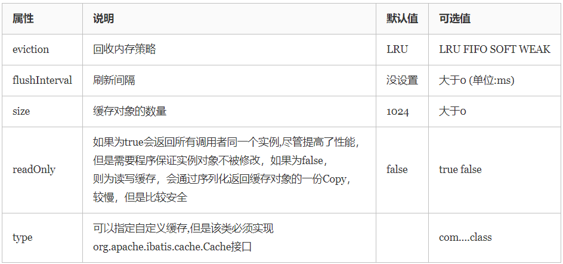

[TOC]

# 级联
## 延迟加载
#### mybatis-config.xml 中 settings 全局配置
包括两个属性：
* lazyLoadingEnabled：是否启用延迟加载
* aggressiveLazyLoading：开启后，带有延迟属性的对象完整加载，反之则按照需要加载

#### association / collection 局部配置
fetchType 属性有两个值：
* eager：立即加载
* lazy：延迟加载

# 缓存
* select 进行缓存，其他操作刷新缓存
#### 一/二级缓存
* 一级缓存是在 SqlSession 上的（默认）
* 二级缓存是在 SqlSessionFactory 上的（需要配置）
#### 二级缓存配置方法
* 在映射文件（Mapper.xml）加入以下标签
```xml
    <cache />
```
* 所有缓存 POJO 实现序列化接口
### 自定义缓存
* cache 标签配置项


* 自定义缓存，要求缓存对象（例如 SqlSessionFactory）实现 Cache 接口
#### 自定义缓存语句
在 select 等标签中可以定义有关缓存的属性
* flushCache：是否刷新缓存
* useCache：是否使用缓存（只有 select 标签有）